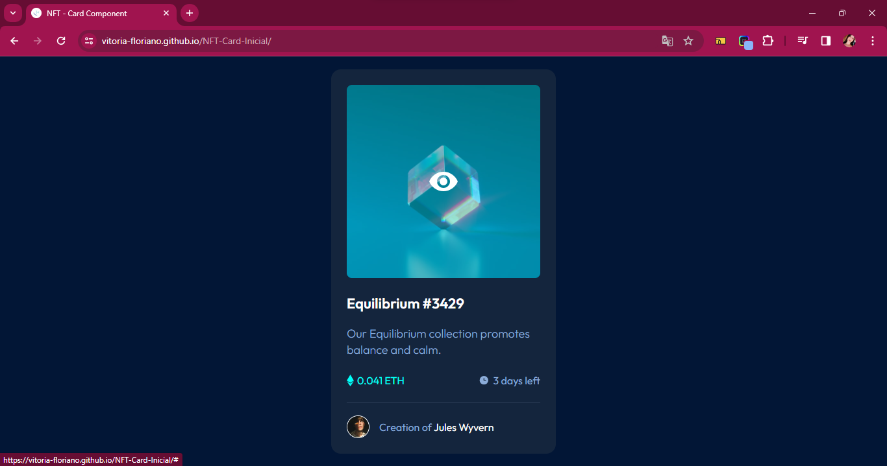

# Frontend Mentor - NFT Preview Card Component

## Bem Vindo

Obrigada por conferir este desafio de Codificação Front-end.

[Frontend Mentor](https://www.frontendmentor.io) desafios para te ajudar a melhorar suas habilidades de codificação construindo projetos realistas.

## O Desafio

Seu desafio é construir esse componente de cartão de visualização e fazer com que pareça o mais próximo possível do design.

Você pode usar qualquer ferramenta que desejar para ajudá-lo a completar o desafio. Então, se você tem algo que gostaria de praticar, sinta-se à vontade para tentar.

Seus usuários devem ser capazes de:

- Ver o layout ideal dependendo do tamanho da tela do dispositivo
- Ver os estados de foco para elementos interativos

Quer algum apoio no desafio? [Junte-se à nossa comunidade](https://www.frontendmentor.io/community) e tire dúvidas no canal **#help**.

## Como Realizei

Fiz o projeto com o Curso Dev Quest, para exercitar a codagem sem travar junto com os professores do Curso. Aprendendo desde análise à montagem do projeto e por fim uma codagem mais fluida, abrindo a mente e o raciocínio antes de colocar a mão na massa. Muito bom!

## O Que Aprendi

Realmente a expandir minha visão e analisar sempre o intuito e o objetivo do projeto, antes de começar a mexer diretamente no código, para que fique mais claro e ainda mais óbvio quais o métodos a serem utilizados na criação do código.

Também aprendi a ter mais foco e produtividade com isso, e provavelmente a ter uma maior organização e objetivação, não só no projeto, mas mental.

## Meus Resultados

Abaixo segue o preview do resultado do meu projeto.

Agradeço desde já aos Professores Ricardo e Roberto Dias por este projeto e aula realizada, me ajudou muito a expandir minha visão.

